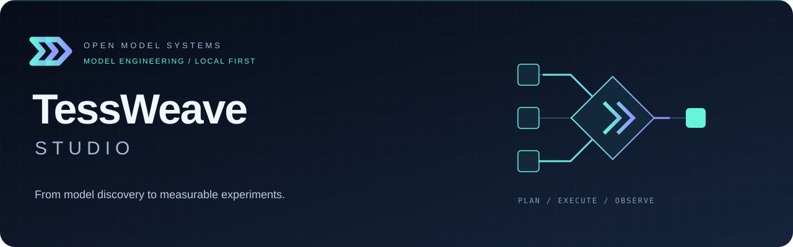

# TessWeave Studio

**Model Workbench**, now the visual workspace in the TessWeave family. The repository is now **[tessweave-studio](https://github.com/Felixgithub2017/tessweave-studio)**. The Python module `workbench`, state directory `.workbench` and existing commands remain unchanged; existing local checkout directories do not need to be renamed.

**Inspectable workflows for local and cloud model engineering.**

Model Workbench is a local-first graphical control plane for model discovery, downloads, metadata inspection, resource planning, training recipes, quantization, inference deployment and observable experiments. It invokes existing engines rather than implementing a new trainer or inference kernel.

**Status: 0.1 engineering preview.** Control-plane tests are not GPU certification. Unsupported combinations are blocked or marked unverified. No universal model support, production SLA, automatic optimal topology or measured speedup is claimed.

[中文使用手册](docs/USER_GUIDE.zh-CN.md) · [Cloud & environments](docs/cloud-and-environments.md) · [Observability](docs/observability.md) · [Paper source](paper/model-workbench.tex) · [Security](SECURITY.md) · [Contributing](CONTRIBUTING.md)

## Studio and Engine

| Project | What it owns | What it does not imply |
| --- | --- | --- |
| **TessWeave Studio** (this repository) | Graphical model engineering, conditional resource planning, reviewed commands, backend orchestration, observations and logs | A new training kernel, universal model compatibility or automatically optimal plans |
| [**TessWeave Engine**](https://github.com/Felixgithub2017/tessweave-engine) (formerly Flow Inference) | Independent inference scheduler targeting single-request latency and concurrent throughput, KV pages, Transformer forward pass, kernels and HTTP server | A fork/wrapper of vLLM/SGLang, certified H100 performance or production readiness |

Studio is a **control plane** and Engine is an **inference runtime**. Both work independently. Studio can use existing third-party engines; using Studio does not require TessWeave Engine. Training continues to use reviewed external training frameworks, not the inference engine.

[**TessWeave Train**](https://github.com/Felixgithub2017/tessweave-train), a separate project under development, adds goal-based post-training guidance, dataset contracts, reviewable SFT/DPO/PPO/GRPO commands and audited backend execution. Its first implementation is a CLI workflow over ms-swift, not a replacement training kernel. A guided Train UI in Studio is planned but not yet integrated; the current Studio training page has its existing support boundary.

The current connection is an explicitly registered loopback HTTP service. One-click Engine launch/unload, dedicated Engine environment recipes, and native Engine-trace visualization are roadmap items, not implemented integration. See [connect Engine to Studio](docs/TESSWEAVE.md) for the exact endpoint, model ID and supported request settings.

Public repositories: [Studio](https://github.com/Felixgithub2017/tessweave-studio) · [Engine](https://github.com/Felixgithub2017/tessweave-engine) · [Train](https://github.com/Felixgithub2017/tessweave-train). Branding changes do not broaden the support matrix. [Brand assets and compatibility policy](docs/BRAND.md).

## Why this project

### Offline research evidence

The [training-design knowledge library](knowledge/README.md) archives official 2026 reports, explicitly historical references, CS336 materials and public training records. The planner loads reviewed bilingual rules offline, exposes release-specific evidence separately from engineering defaults, and records rule/source hashes. Run `python3 tools/knowledge_status.py` to verify actual local downloads. Full texts without reviewed redistribution rights stay in the permanent local `.knowledge-cache`; they do not inherit this project's MIT license.

The Resources selector shows curated common models and local models in descending total-parameter order; other entries can be filtered or searched on HF/HF Mirror. This is not a live popularity ranking. Nominal counts label and order the list only; selecting a cloud entry fetches metadata and does not download weights or establish backend support.

Each training result now exposes a five-step decision path: workload identity, estimator applicability, constrained enumeration, objective ranking, and required measurements. Counts and rejection reasons come from the solver, with source rules attached to relevant steps. Per-card ledgers include precision, bytes per element, estimated element count, byte volume and substituted formulas. Mixed workspaces stay labeled as budgets rather than fabricated tensor counts; unknown hybrid activations remain unknown.

### Model identity and official training references

Resource planning displays the declared model identity separately from the local folder name, the exact unquantized tensor-element count from weight headers, and official nominal/active parameter counts where verified references exist. Tensor storage counts are not necessarily unique trainable parameter counts; quantized packed elements must not be treated as original parameter counts. Metadata matching does not authenticate a checkpoint.

The expandable official-training comparison includes provenance links and review dates. The initial reference catalog covers GLM-5.3-Flash and its BF16 release only; other releases explicitly show no verified reference. Undisclosed GPU counts, parallelism, training precision and batch sizes remain unknown. A linked older model report is not substituted for a newer release. Official pretraining clusters and minimum-capacity experiments have different objectives, so no misleading similarity score is produced.

The primary training view now includes a bounded joint planner: TP/PP/DP/CP, a restricted EP layout, framework-specific state sharding, recomputation, token budgets and optional time/cost sensitivity. See [October 2026 rules and reproducible scenarios](docs/training-design-rules-2026-10.md). It does not execute training or certify a backend. Unsupported architectures and multi-role RL fail closed. The old ZeRO-only audit is retained in a collapsed section, not presented as the joint recommendation. Validate architecture-specific memory and communication before renting hardware.

Researchers should be able to change a model, dataset or engine without losing the command that produced an experiment. Engineers should be able to distinguish a feasible-looking memory estimate from an actual successful deployment. Workbench joins these activities with explicit execution hosts, reviewable plans and persistent logs.

Modules are independent: connect an existing service directly, inspect an offline model without installing PyTorch, or follow the full download-to-evaluation workflow.

## Quick start

Model selection uses persistent metadata caches. The MiMo-V2.6-Pro-RL entry includes a dated
ModelScope config snapshot for first-launch offline use. Other uncached entries try HF and
its mirror without proxies; failures appear beside the picker with a source-refresh action.
Resource calculation never refetches cloud metadata. Publisher nominal counts are explicitly
labelled estimates, not scanned logical counts. A readable config does not establish training
support: hybrid/multimodal and quantized checkpoints still require architecture/backend validation.

Requirements: Python 3.9+, macOS or Linux (Windows through WSL). The control plane uses Python's standard library; training and inference dependencies belong in separate environments.

From this project directory:

```bash
python3 -m workbench serve --open
```

For weights outside the project, authorize an **existing** directory:

```bash
python3 -m workbench serve --open --allow-root "/absolute/model-library"
```

Repeat `--allow-root` for model/data/environment parents. Paths belong to the host running Workbench, not the browser. Symlink targets must also be authorized. `--allow-root /` permits browsing OS-accessible paths broadly; use it only if you understand that exposure.

Keep the terminal open. Open the complete URL printed at startup, including its session fragment. This is a local session credential, not a Hugging Face token. Never share it. macOS also supports `./start.command`.

Stop deliberately: stop active workloads first, then Ctrl+C in the control-plane terminal. Restart using the same command and the **new** URL. Keep the same state directory to retain records. Closing the browser does not stop the server.

## First deployment: an actionable path

1. **Hosts & environments:** confirm the displayed execution host. Create an isolated engine environment if needed. Choose MLX LM for the current Apple Silicon text-model recipe, or vLLM/SGLang for a supported NVIDIA server.
2. **Deployments → New deployment:** choose a previously scanned local model from the persistent selector, or **Choose directory → Inspect selected model**. Select the actual model package, not its parent library. Model files are read in place; they are not uploaded.
3. Choose the engine and its `bin/python`. Set context length, GPU count, TP and an unused service port. Current NVIDIA recipes use a single-instance TP layout, so TP must equal selected GPU count.
4. **Preview command & preflight:** inspect blockers, versions, exact launch command and warnings. This does not load a model or start a process.
5. **Confirm and run:** a native terminal opens on supported macOS desktops; headless hosts use managed logs. Read the new deployment's live output.
6. After loading, find the registered service and **Check API**. Process-running status is not model readiness; a successful `/v1/models` check is not generation validation.
7. **Open playground → Send** a small prompt. Finally, run a small evaluation and save its workload/report before changing precision or engine.

An entry from the cloud catalog is not a local model. Download it first. MLX service identifiers can differ from the NVIDIA recipe's `workbench` identifier: inspect the model IDs returned by Check API and register the exact one if necessary.

## Workspaces

| Workspace | Inputs | Outputs / action |
| --- | --- | --- |
| Cloud model catalog | Provider, organization, filters | Model details, manifest, direct-download tasks |
| Models | Authorized local folder | Persistent library, config and safetensors tensor map |
| Datasets | Task, selected model, JSONL | Format examples and structural validation |
| Resources | Parameters, architecture, precision, workload | Conditional memory ledger and topology candidates |
| Hosts & environments | SSH alias or new venv path | Cloud workspace/tunnel or version-recorded environment |
| Training | Local model, data, backend Python | Reviewed CPT/SFT/DPO/limited GRPO recipe and task logs |
| Quantization & compression | Source model, method, calibration inputs | Separate output artifact; no promised speedup |
| Deployments | Local model or existing service | Engine process, registered endpoint, startup logs |
| Playground | Registered text service | Streamed conversation, observations and replay logs |
| Evaluation | Endpoint, prompts, request/concurrency limits | Persisted performance report |
| Runs & logs | Task ID | Command, state, original output, extracted metrics |

## Current capability boundaries

- Model scanning reads configuration and safetensors metadata without importing repository code or unpickling weights. Recognition does not prove backend support.
- CPT/SFT/DPO and mathematical-reward GRPO use audited ms-swift recipes targeting **4.5.x**. PPO is blocked pending complete reward/value-model orchestration. RLHF is a workflow, not a single universal dataset format.
- vLLM/SGLang/MLX are deployment adapters. Workbench does not implement their kernels. GTX 1070 is blocked by the current NVIDIA recipes.
- AWQ/GPTQ/FP8/MLX 4-bit are recipe-dependent paths; pruning and sparsity entries do not imply working adapters. Re-quantizing arbitrary quantized input is blocked.
- The library may inspect more architectures/modalities than it can train or serve. Playground supports text and bounded inline PNG/JPEG inputs for an explicitly image-capable service; this does not add vision support to a text-only engine. Audio/video interaction is not implemented.
- Resource estimates expose assumptions and user-supplied budgets. Zero optional overhead means **unbudgeted**, not free. DPO/PPO/GRPO require separate accounting for their model roles and rollout pools.
- Benchmarking is bounded, closed-loop and not a production SLO certification. Token counts come from engine usage, never SSE event counts.

## Cloud workflow

**Hosts & environments → SSH probe → review connection plan → execute → Open cloud workspace.**

Only application source is uploaded. The remote workspace downloads weights directly and owns its environments, model paths and workloads. The SSH tunnel binds locally; the remote control plane binds to loopback. No passwords or private keys are stored by this UI.

Stopping the connection task stops the tunnel **only**. Remote jobs survive disconnection; reconnect with the same alias/root/remote port. Stop remote training/deployment inside the remote workspace. Boot-time service management, fleet scheduling and one-click remote control-server shutdown are not implemented.

See the [step-by-step cloud guide](docs/cloud-and-environments.md).

## Environments and reproducibility

Environment provisioning creates an isolated environment (Conda/Miniforge by default, with a venv option), resolves wheel dependencies, records exact versions, installs them, runs package checks, and performs an import/GPU probe. It never overwrites an existing environment or installs drivers. Missing wheels fail explicitly. Choose a compatible Python and primary package version; for the current training adapter choose ms-swift 4.5.x.

Resolution produces a version lock and resolver report, not a fully immutable, hash-enforced wheelhouse. Successful installation is not model/GPU certification. Use **Use this Python** to fill experiment forms.

## Downloads and network behavior

Public Hugging Face, HF Mirror and ModelScope repositories are supported. Model details and manifests precede file selection. Downloads show automatic progress/status refresh and recent transfer speed, support pause/resume, and allow archiving a record without deleting weights.

Hub requests and downloads disable implicit HTTP proxies; environment installs use official PyPI with implicit proxy configuration disabled. VPN/TUN/transparent routing can still intercept traffic. No gated/private repository credential manager is provided. Provider metadata, file sizes and availability can change; inspect the pinned manifest/revision.

See [model downloads and structure](docs/models-and-downloads.md).

## Observability, not animation as evidence

Live conversation logs contain application-layer byte counts, arrival times and engine usage. Host samples use NVIDIA tools or best-effort Apple driver counters; SSH sampling is explicit. Supported vLLM/SGLang KV/queue series remain engine-wide, not per-request measurements.

Profiler controls and Chrome/PyTorch trace import expose recorded operator durations and input shapes. Full traces are normally inspected **after capture**, not as live matrix values. Missing shape metadata stays unknown. MLX internals and automatic request-to-kernel correlation remain unsupported.

See [measurement scopes and replay](docs/observability.md).

## Architecture

```text
Browser UI
  → authenticated loopback API
  → inspect / validate / estimate
  → persist plan → explicit confirmation → owned execution
  → native or managed terminal → external engine
  → logs / service checks / measurements / replay

Local workspace → SSH source bootstrap + tunnel → independent cloud workspace
```

| Code | Responsibility |
| --- | --- |
| `workbench/server.py` | Authenticated API and operation audit |
| `inspection.py`, `model_library.py`, `hub.py`, `downloads.py` | Model metadata and artifacts |
| `data.py`, `resources.py`, `adapters.py` | Contracts, estimates, backend recipes |
| `jobs.py`, `native_runner.py` | Persistent state, process ownership and logs |
| `environments.py`, `environment_runner.py` | Isolated environment plans and execution |
| `cloud.py`, `cloud_runner.py` | Remote bootstrap and tunnel |
| `services.py`, `benchmark.py`, `telemetry.py`, `profiler.py` | Serving and evidence collection |
| `static/` | English/Chinese browser interface |

## State and logs

Default state is `.workbench/`; override with `--state`.

- `operations.log`: API, command and output audit.
- `<job-id>/manifest.json`, `terminal.log`: plan and full execution output.
- Environment jobs: `resolve.json`, `resolved-requirements.txt`, `environment-commands.jsonl`.
- `services.json`, `jobs.sqlite3`: service registrations and task state.
- `chat-recordings/`: conversations, measurements and imported profiler captures.
- `benchmarks/`: performance reports.
- Remote workspace: independent state under the selected cloud root.

Logs may contain prompts, paths and sensitive workload data. Credential redaction is best effort, not a data-loss-prevention guarantee. Protect logs, review before sharing, and manage retention. Never delete state merely to restart.

## Testing and contribution

The [initial publication checks](docs/PUBLICATION.md) distinguish local regression evidence from GPU validation and document which local files are deliberately excluded.

```bash
python3 -B -m unittest discover -s tests -q
```

The suite includes metadata bounds, path restrictions, confirmation gates, downloads, stream semantics, profiler parsing and an isolated loopback cloud-bootstrap/reuse test. Browser protocol verification:

```bash
PYTHONPATH=. python3 -B tests/manual_service.py
```

This uses ports 8766/18081 and synthetic responses, **not a real model benchmark**. No cloud/GPU validation is implied. See [CONTRIBUTING](CONTRIBUTING.md) for contribution expectations and [SECURITY](SECURITY.md) for the local single-owner threat model.

## Documentation and paper

- [完整中文使用手册](docs/USER_GUIDE.zh-CN.md): deployment walkthrough, parameter reference, all modules, recovery and experimental practice.
- [Cloud/environment guide](docs/cloud-and-environments.md).
- [Observability guide](docs/observability.md).
- [Paper](paper/model-workbench.tex): standalone English LaTeX system report.
- [Paper submission checklist](paper/README.md): authorship, evidence and arXiv source preparation.

The paper is a draft, not an accepted publication. Authors, affiliations, public repository URL and real GPU experiment results require owner review before submission.

## License

MIT; see [LICENSE](LICENSE). Third-party engines, model weights, datasets and bundled assets retain their respective licenses. Workbench does not grant rights to gated models or training data.
