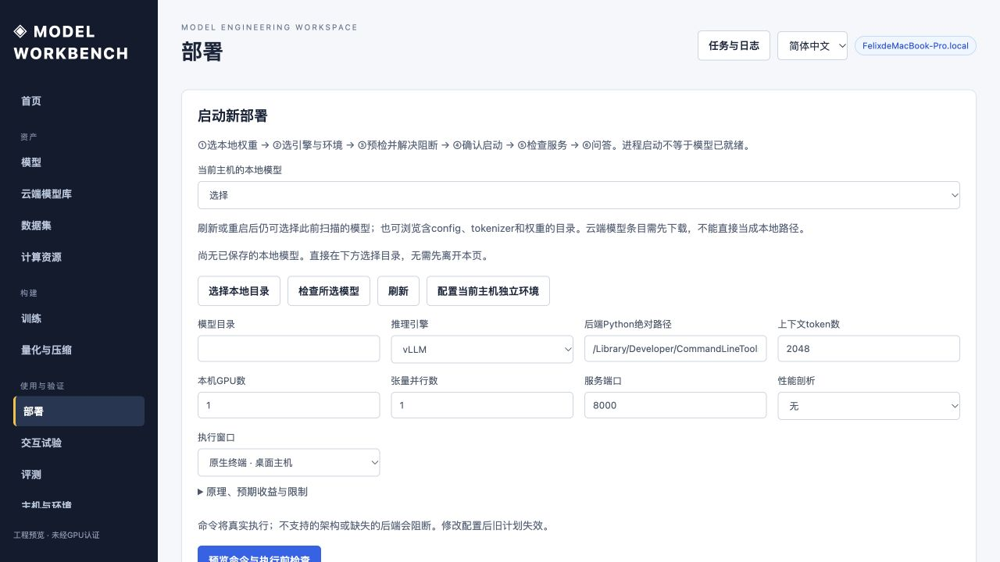

# Model Workbench 使用说明书

## 资源规划：先看分配，再看账本

### 2026-10 联合训练规划器

训练页面现在优先展示联合规划，旧版 ZeRO-only 账本折叠保留。先选模型或填写结构，再填写本次总训练 token、目标每步 token、固定卡数或搜索上限以及节点内互联。展开可选区填写有效算力、链路带宽、单价、MoE 专家参数。未测量可留 0；此时只给容量候选，不宣称速度和成本最优。

三个结果入口分别为「最低容量」「预计最低成本」「满足期限」。按钮不可用表示缺少相关输入或没有合格候选。公式、分项精度、瓶颈信号、淘汰计数与配置草案均可查看；仍不会自动执行训练。旧版「额外GPU数」不适用于联合搜索，请使用固定卡数或搜索上限。

完整规则、八个可复算尺寸案例和限制见 [训练方案设计规则](training-design-rules-2026-10.md)。本轮支持全参 CPT/SFT/预训练分析与受限标准 MoE；混合注意力、MLA、多模态、RL 多角色及 LoRA 联合搜索尚不能可靠规划，会明确阻断。

### 旧版容量审计说明

在「计算资源 → 容量与拓扑规划」选模型、任务与 GPU，点击「计算候选方案」。新分配图按节点分组，每张 GPU 显示逻辑 rank、TP/PP/DP 坐标和按物理容量同比例绘制的显存条。点击任意 GPU，查看层区间、通信组、每项显存及计算依据。节点较多时每页显示四个节点。

方案顶部展示模型声明名称、仓库标识、扫描的完整存储元素数，以及有来源的官方标称总参数／激活参数。两种口径不能混用：权重头部计数可能包含缓冲区、共享权重差异，不能直接当成严格可训练参数数；元数据匹配也不是权重真实性校验。旧模型记录重新选择后会读取 README 标题并更新名称。

展开「官方训练配置与本方案对照」查看训练阶段、token 数、GPU、并行、ZeRO、精度和批量／序列长度，附来源链接和核查日期。初始资料库仅覆盖 GLM-5.3-Flash 及 BF16 版本，其他模型明确提示尚无已核查资料。官方未披露的字段保持未知，不从旧版本报告或发布权重精度推断训练配置。容量估算不等于完整预训练的吞吐最优配置，不给出虚假的接近程度评分。MoE、混合注意力或跨节点候选明确标为受限估算，不能直接按其卡数租机。

- ZeRO 无需用户选择：系统分别计算 0/1/2/3 阶段，优先满足含预留的显存预算，再按“所需卡数最少、分片阶段较低”排序。指定 GPU 数时严格使用指定数量，不擅自增加卡数。每个 GPU 型号独立评估，不沿用其他型号的 ZeRO 结论。
- 方案顶部展示自动推荐及四阶段对照：条件最低卡数、分配卡数、每卡峰值、剩余预算和取舍原因。全部不可行时不推荐任何阶段，后面的账本仅用于诊断。旧调用中的手动 zero_stage 不再控制公开规划接口。
- 这是节约卡数及减少分片复杂度的启发式推荐，不是最低训练总费用或最快训练的证明；未测量网络、通信重叠、步耗时、租赁价格与收敛时间。系统不会擅自降低精度、改变训练方式或开启 Offload。训练 TP/PP/CP、MoE 专家并行、多角色强化学习仍不在此搜索范围内。
- 页面主线为「推荐摘要 → GPU 分配图 → 所选 GPU 的显存计算」。顶部常显精度、并行度、ZeRO、B/S；高级输入、备选方案、完整假设和其他硬件对比默认折叠，避免重复表格。
- 每张 GPU 卡片仍显示主要显存类别。下方只保留一份所选卡账本：精度／字节数与 GiB 常显，展开分项可看数值代入公式、该项用途，以及它是参数公式、结构近似、格式近似还是手填预算。权重计算默认展开，零值／未知项单独折叠。
- 例如 7B 权重按 BF16 每元素 2 字节、ZeRO-2 不分片权重：7,000,000,000 × 2 ÷ 1 ÷ 2³⁰ ≈ 13.039 GiB。Adam m 按 FP32 每元素 4 字节，再除以 DP 卡数。激活中的系数 12 是合计临时张量近似，不是一种 12 字节精度。所有 dtype 都是规划假设，不宣称已核验引擎运行时精度。
- 设 P 为可训练参数、D 为 DP 卡数，BF16 全参数 Adam 的持久状态（字节）分别为：ZeRO-0：16P；ZeRO-1：4P+12P/D；ZeRO-2：2P+14P/D；ZeRO-3：16P/D。LoRA 只对适配器计梯度与优化器，冻结基座另算；QLoRA 多卡仍不推定可用。每行给出实际除数。激活与工作区不自动除以 D，ZeRO-3 的临时参数聚合另加，通信缓冲需明确预算。
- 这些阶段描述依据 [DeepSpeed ZeRO 文档](https://deepspeed.readthedocs.io/en/latest/zero3.html)。自动推荐作用于容量方案，尚不自动配置训练引擎；分布式桶、预取和状态持久化策略可能产生额外峰值。
- 推理当前估算 TP×PP：权重近似平均分片；KV 按层和 KV 头分配，TP 超过 KV 头数时包含复制。层划分、嵌入层、混合注意力或 MoE 的不均衡仍需专项核验。
- 显存条包含安全预留，文本峰值不包含预留：容量 − 估算峰值 − 预留 = 剩余预算。负数表示超预算。显存占比不是计算耗时或 GPU 利用率；本图没有虚构 FLOPS 或网络吞吐实测。
- 「张量与流水线数据流」展示阶段内矩阵切分、阶段间激活传递；训练 DP 的聚合与梯度同步另作说明。
- 「探索上下文切分」允许观察 CP=1/2/4/8 的序列切分。这是原理示意，**不会修改容量或启动计划**。当前规划 CP=1；尚未实现训练 TP×PP×CP 混合并行容量模型。不能用图中的 CP 数自动除掉权重、优化器状态或全部激活。

这些是基于输入假设的逻辑分配，不是已连接服务器的物理映射，不保证装得下或最快，不会自动把分配写进训练/部署命令。部署前仍应核对引擎支持，测量逐卡峰值、通信与实际层分配。计算请求和响应仍进入既有审计链路。

并行概念参考：[NVIDIA Megatron Core 并行指南](https://docs.nvidia.com/megatron-core/developer-guide/latest/user-guide/parallelism-guide.html)、[Context Parallel 文档](https://docs.nvidia.com/megatron-core/developer-guide/latest/user-guide/features/context_parallel.html)。

适用版本：0.1 工程预览版。面向算法工程师和研究人员。本文把“生成命令”“启动进程”“模型就绪”“实验有效”分开：前一步成功不代表后一步成功。

## 1. 第一次使用：先跑通一个小文本模型

不要第一次就选最大的 MoE。先用一个后端明确支持的小模型，验证环境、路径、服务和日志，再放大参数量。本工具不是新训练引擎，而是把现有引擎组织成可检查、可执行、可追溯的工作流。

在项目目录打开终端：

```bash
python3 -m workbench serve --open --allow-root "/Volumes/你的磁盘/模型目录"
```

路径必须已经存在。需要数据目录和环境目录时可重复传入 `--allow-root`。本机 Mac 的路径不能直接用于云端服务器。启动终端不要关闭；浏览器打开启动输出的完整链接，会话令牌不是 HF 账号令牌。重启后使用新链接。

### 选择模型与启动部署



截图来自隔离界面测试环境，因此本地列表为空；不是实际模型部署成功的证明。

| 顺序 | 在哪里操作 | 应该看到什么 | 这一步没有做什么 |
| --- | --- | --- | --- |
| 1 | 主机与环境：确认执行主机 | 主机名、平台、硬件探测 | 没有安装 GPU 驱动 |
| 2 | 创建推理环境，选择配方与 Python | 安装任务、解析结果、版本记录、检查输出 | 安装成功不保证模型兼容 |
| 3 | 部署 → 启动新部署 → 本地模型下拉框 | 之前扫描并保存的本地模型 | 云端搜索结果不是本地权重 |
| 4 | 没有目标模型时选择目录，再检查所选模型 | 真实模型路径、识别信息或明确错误 | 不上传权重，不执行模型仓库代码 |
| 5 | 选择引擎、环境 Python、上下文与端口 | 完整部署表单 | 不会自动加载模型 |
| 6 | 预览命令并检查前置条件 | 具体命令、阻断项、警告、计划 ID | 仅生成计划 |
| 7 | 确认并执行 | 新部署日志；支持的桌面环境弹出终端 | 进程启动不等于服务就绪 |
| 8 | 服务列表 → 检查 API | `/v1/models` 返回模型 ID | API 通不等于推理正确 |
| 9 | 打开交互试验，发送一个短问题 | 流式回答和观测记录 | 一次成功不代表吞吐/SLO 达标 |

目录应选择包含 `config.json` 和权重分片的模型包，不是包含多个模型的上级目录。可以从“模型”页先扫描整个模型库，再回到部署页刷新列表。刷新页面后，本地模型记录仍从持久化模型库读取。

MacBook Apple Silicon 的当前文本部署路线选择 **MLX LM**；NVIDIA 云服务器选择经过模型和版本检查的 **vLLM 或 SGLang**。不要在 Mac 上选择 CUDA 路线。48 GB 统一内存还要容纳系统、程序和缓存，不能把 48 GB 全部当模型预算；不承诺最大规模模型能装下。

Gemma 4 的纯文本部署配方已单独接入 `mlx-lm 0.32.0`，支持识别为
`gemma4` / `gemma4_text` 的模型。后端从原始多模态权重提取语言模型部分；
这不代表图片、音频输入已经支持，也不放开尚未适配的训练或量化任务。
在部署页选择已有 `workbench-mlx/bin/python`，性能剖析选“无”，重新预检。
更新平台代码后必须重启控制台再生成新计划；旧计划保留的是旧检查结果。
外置盘加载大权重可能较慢：进程启动、API 就绪和成功生成是三个不同阶段。

在“已登记服务”点击“检测模型是否可回答”，工作台会发送短文本请求，收到
正文后显示“已验证可回答”和检测时间；它不保证模型质量或未来请求持续可用。
超时只表示尚未验证，外置盘仍可能在加载，可稍后重试。
点击“卸载模型 · 停止服务”并确认，会停止本控制台拥有的推理进程，保留权重。
刷新后确认进程已退出再复用同一端口。外部服务或控制台重启后失去管理权的
进程，需要在原启动终端停止；工具不根据历史 PID 杀进程。

视觉服务可在交互页选择 PNG/JPEG 图片（单张最多256 KiB，对话请求有总大小限制）。
登记已有服务时必须如实声明“文本＋图片”，该声明本身不会赋予模型视觉能力。
当前 Gemma 4 MLX 文本配方不支持图片；音频、视频输入尚未接入。
图片随会话写入日志，处理隐私图片前应确认日志访问与留存要求。

### 部署参数逐项理解

| 参数 | 意义 | 如何选择 |
| --- | --- | --- |
| 模型目录 | 引擎在执行主机上读取的完整模型包 | 用目录选择器或持久化本地库 |
| 后端 | 真正执行推理的引擎 | 根据平台、架构及量化格式选择，不是越多叠加越快 |
| 后端 Python | 安装了对应引擎的解释器 | 例如独立环境的 `bin/python`，不是任意系统 Python |
| GPU 数量 | 本次实例要使用的卡数 | 当前 NVIDIA 配方要求与 TP 相等，并不代表任意卡可混用 |
| TP | 张量并行份数 | 要通过卡数和模型维度整除检查；跨机调度不是此启动配方的能力 |
| 上下文长度 | 本次服务允许的序列容量 | 初次验证先用较短值；增大将增加 KV 容量压力 |
| 端口 | 本机回环服务监听端口 | 选择没有被其他服务占用的端口 |
| 输出/运行目录 | 实验产物与记录位置 | 使用新目录；不要覆盖已有产物 |

查看预览命令才是判断实际配置的最终依据。当前 NVIDIA 配方设置约 0.80 的引擎显存利用率参数，这是分配策略而非“实测 GPU 利用率 80%”。MLX 的接口模型 ID 可能不是 `workbench`；按 API 检查返回值重新登记服务的准确 ID。

### 接入已经运行的服务

无需重复下载或部署。直接在部署页登记受支持的本机回环 API 地址与模型 ID，检查 API，再进入交互试验。远程服务通过受控 SSH 转发接入，不要将无认证控制台暴露到公网。

## 2. 云端 GPU：在云端下载、部署、训练

先在系统 `~/.ssh/config` 配置别名，使用终端验证密钥登录和主机指纹。界面不保管密码或私钥。

1. 主机与环境：填写 SSH 别名，执行只读巡检。
2. 选择专用远端工作目录和两个端口，生成连接计划，检查命令，再执行。
3. 点击“打开云端工作台”，确认页头显示的是云端主机。
4. 在云端工作台创建环境、选择下载目录、下载模型、准备数据。
5. 在该工作台部署或训练。权重不经过 Mac 中转。
6. 本地断开隧道不会停止云端任务；重新连接同一目录与端口可继续查看。停止任务要在云端任务页操作。

此流程上传的是工作台源码，不是本地模型、数据或 SSH 密钥。它不是多租户集群调度器，不负责云厂商停机计费。实验结束后自己确认进程、云实例和计费资源都已停止。完整步骤见 [云端与环境](cloud-and-environments.md)。

## 3. 环境：先检查，再安装，再复用

给下载、训练、推理分别建环境，避免包依赖冲突。环境目录必须是尚不存在的新目录，其父目录需要授权。选择兼容的基础 Python 和配方主包版本；当前训练适配器面向 **ms-swift 4.5.x**，不是任意最新版。

执行过程：新建 venv → pip 解析 wheel → 记录解析报告与精确版本 → 安装 → `pip check` → `pip freeze` → 导入与设备检查。所有命令和输出留档。成功后点击“使用此 Python”填充实验表单。

失败时先看失败的具体命令，不要反复点击安装。此功能不安装显卡驱动、不执行 sudo、不自动编译缺失 wheel。版本清单不是完整的哈希锁定制品仓库，跨平台重建仍需验证。

## 4. 模型：检索、下载与扫描是三件事

云端模型目录展示厂商/组织与可用筛选字段。先看模型详情、参数信息、许可证、架构和文件，再决定下载。平台不提供的字段应视为未知；筛选结果不保证覆盖所有厂商和版本。

下载前选择源、测试速度、选择或创建目标文件夹。短探测速率只是当前链路样本，不是全程速度保证。HF、HF Mirror、ModelScope 的请求和下载禁用隐式 HTTP 代理；系统 VPN/TUN/透明代理仍可能接管流量，不能保证绕过这类路由。

下载任务自动更新进度、近期速度和状态；暂停后可以续传。删除/归档下载记录不会删除模型文件。没有私有或 gated 模型的凭证管理器。外接磁盘断开后，应恢复挂载并核对路径再重试。

本地扫描读取配置及 safetensors 头部，不把巨量权重载入内存，不反序列化不可信 pickle。参数张量图展示文件中的形状；压缩打包张量的元素数不必等于原始模型参数量。识别架构不等于训练/部署后端已支持它。参见 [模型与下载](models-and-downloads.md)。

## 5. 数据集：得到格式指南，而不是自动得到训练数据

选择模型和训练方式，按钮输出**格式说明、样例、字段要求与准备建议**；不会自动采集、清洗、标注或生成合格数据。样例仅展示概念结构，最终以界面给当前适配器的格式和校验结果为准。

| 任务 | 一条样本要表达什么 | 关键风险 |
| --- | --- | --- |
| 继续预训练 CPT | 一段可预测后续 token 的文本 | 去重、污染、许可证、混合比例与文档边界 |
| SFT | 用户输入与应学习的助手输出，可多轮 | chat template、监督掩码、截断、角色边界 |
| DPO | 同一输入的优选与拒选回答 | 偏好标签质量、配对一致性、参考策略 |
| GRPO | 提示及可用于奖励判断的答案/规则 | 当前是数学奖励配方，不是任意环境奖励 |
| PPO / RLHF | 策略、参考、奖励、价值或环境的完整流程 | 不是一个 JSONL 格式就能解决；当前 PPO 执行被阻断 |

JSONL 表示每行一个 JSON 对象，不是把所有样本包在一个大数组里。文件结构校验只能发现格式问题，不能保证事实、偏好、奖励或模型效果正确。先用少量真实样本做验证，再扩大数据量。

## 6. 计算资源：看账本与假设，不只看卡数

先选择已扫描本地模型；缺少可靠参数时人工填写并核对，不能把空白或 0 当作参数量。输入总参数量、精度、序列长度、微批或驻留序列数、训练方式和拓扑约束。

基本核算（内存单位需统一）：

- 权重：参数量 × 每参数存储字节。7B BF16 约 14 GB，即 13.04 GiB，仅是权重。
- 全量混合精度 Adam 的一种常见布局：BF16 权重 2 + BF16 梯度 2 + FP32 主权重 4 + 两份 FP32 状态 8 = 16 字节/参数。实现不同可能不同；7B 此项约 104.31 GiB，尚未加激活。
- 激活：受层数、宽度、序列、微批、注意力实现、重计算共同影响，不是固定“参数量倍数”。
- 普通 GQA/MHA KV：2 × 层数 × KV 头数 × 每头维度 × 总缓存 token 数 × 缓存元素字节；MLA、滑窗、混合层需专门布局，不能硬套。
- 额外预算：通信缓冲、CUDA Graph、运行时、临时工作区、碎片及安全余量。
- 后训练：策略、参考、奖励、价值、rollout 引擎分别核算；它们是否同驻、分卡或卸载会改变峰值。

MoE 驻留权重看总参数，计算负担才与激活专家有关。LoRA 减少可训练状态，不自动让底座权重消失。ZeRO、TP、PP 各自切分不同对象，不能把账本每一项一律除以总卡数。

结果里的“依据”应与配置一起保存。可选开销填 0 表示没有纳入预算，不表示实际没有开销。拓扑候选是条件估算，不是自动证明最小卡数或最优性能；上机后以峰值内存、通信 trace 与实际吞吐校准。参见 [详细资源账本](resource-planning.md)。

## 7. 训练：生成计划之后还要执行

工作流：模型 → 数据 → 后端 Python → 任务/精度/批次/输出目录 → 生成检查计划 → 修复阻断项 → 确认执行 → 查看日志/检查点 → 离线评估 → 部署验证。

| 参数 | 实验意义 |
| --- | --- |
| 学习率 | 每次更新的尺度；沿用适合任务和参数训练范围的基线 |
| 微批大小 | 每个设备每次前向处理量，影响激活峰值 |
| 梯度累积 | 用多次微批形成一次更新；与 DP 一起决定有效批次 |
| 序列长度 | token 截断/拼接边界，也改变显存与每步 token 数 |
| 步数/epoch | 本次实验预算；跑通实验与充分收敛是不同目标 |
| LoRA 配置 | 训练低秩增量而非更新全部权重；以实际命令为准 |
| 输出目录 | 保存独立实验制品，不覆盖上一轮结果 |

计划阶段记录输入与前置条件，执行前再次检查。修改表单后需要重新生成计划。第一次只跑短实验，确认 loss 有限、保存可读、恢复与加载路径正确；loss 下降不能替代任务评估。当前不能把任意量化权重包直接继续全参训练。

## 8. 量化与压缩：独立产物，成对比较

此模块主要处理模型存储和计算精度，不是训练加速总开关。选择源模型、受支持方法、校准输入（需要时）与新的输出路径，先检查计划再执行。

低比特降低权重字节数；是否更快取决于硬件、反量化代价、kernel、batch 与工作负载。AWQ/GPTQ、FP8、MLX 4-bit 的格式与运行环境不同，不能把一个方法的产物随意交给另一个引擎。剪枝/稀疏占位项不是已经完成的工业适配器。

保存基线和压缩模型，用相同提示集、长度、采样参数、并发做性能与质量对照。至少比较答案质量、峰值内存、首响应、请求时延和吞吐，不能仅比较文件大小。

## 9. 交互、资源观测与回放

交互试验选择已登记服务，不是直接选择磁盘权重。当前界面是文本对话，不能宣称已支持图片/视频/音频输入。发送后显示流式内容；取消请求不保证后端所有计算立即终止。

| 展示 | 实际含义 | 不代表什么 |
| --- | --- | --- |
| 主机负载/内存 | 整台主机观测 | 单条问题独占资源 |
| NVIDIA 利用率/显存/功率 | 设备采样 | 完整 kernel 因果分析 |
| Apple 驱动指标 | 尽力采集的驱动级观测 | CUDA VRAM 或模型独占内存 |
| 网络收发 | 主机接口累计计数 | 自动分离了模型/NCCL 流量 |
| 引擎队列/KV 指标 | 后端实际暴露的 metrics | 任意版本都提供相同名称 |
| Profiler 时间线 | 导入 trace 的真实事件/可用 shape | 实时还原全部矩阵数值 |

实时日志可以回放。Profiler 需要引擎预配置，并明确开始/停止；远端 trace 需在对应授权路径读取。合成示例不是真实 GPU 成绩，不要用于论文性能表。详见 [观测与回放](observability.md)。

## 10. 评测：先固定工作负载

当前是有界闭环请求测试，最多 200 请求、并发 1–16；不是开放到达率压测。记录模型、版本、硬件、精度、输入/输出长度、并发、预热、错误和 workload 标识。来自引擎 usage 的 token 数才用于 token 指标；SSE 消息条数不是 token 数。

首流式事件可能是 reasoning，首可见回答是另一个指标。端到端 token/s 包含请求等待等时间，不等于纯 decode 速度。做三次以上同条件重复测试更有参考价值，但工具不自动保证统计显著性。

## 11. 日志、停止与故障处理

任务与日志页面保留命令、状态、退出结果、原始日志。状态目录下 `operations.log` 是操作审计；任务目录含 manifest 和 terminal 日志，观测记录用于回放。展示窗口可能只取日志尾部，完整文件仍需在磁盘查看。状态目录由启动配置决定，默认 `.workbench`。

| 现象 | 先检查 |
| --- | --- |
| 要求会话令牌 | 重新打开启动终端打印的完整 URL，不要填写 HF token |
| 目录不在列表/无权限 | 执行主机是否正确、授权根、符号链接目标、系统权限、磁盘挂载 |
| 本地模型列表为空 | 先扫描保存，或部署页直接选择真实模型目录并检查 |
| 参数量超出范围 | 模型元数据是否缺失、空输入、单位是否为十亿参数 |
| 引擎未安装 | 后端 Python 是否指向安装环境，而非系统解释器 |
| 模型/量化不支持 | 查看适配器阻断项，不能通过关闭验证伪装支持 |
| 进程运行但 API 不通 | 权重加载尚未完成、端口、OOM、引擎错误日志 |
| API 可达但模型不存在 | 用 `/v1/models` 的真实 ID 更新登记信息 |
| 云端断开后仍计费 | 断开隧道不是停止服务或关闭云实例 |

关闭网页不会停止任务。先在任务页停止不需要的负载，再停止控制台；远端另行停止。切勿公开会话链接、包含凭证的命令、训练数据或对话日志。界面脱敏不是全面数据防泄漏系统。

## 12. 一次可交付实验应该留下什么

至少保存：模型来源与版本、数据来源与切分、环境解析/版本文件、执行计划与完整命令、硬件与资源假设、训练/推理原始日志、实际测量、质量评估、失败样本及复现实验步骤。

工作台减少重复操作，但不会替研究者决定数据是否合规、结果是否可信、部署是否满足生产要求。跨节点训练、全部模型/模态适配、多用户权限、生产调度与 SLA 仍需额外工程验证。
