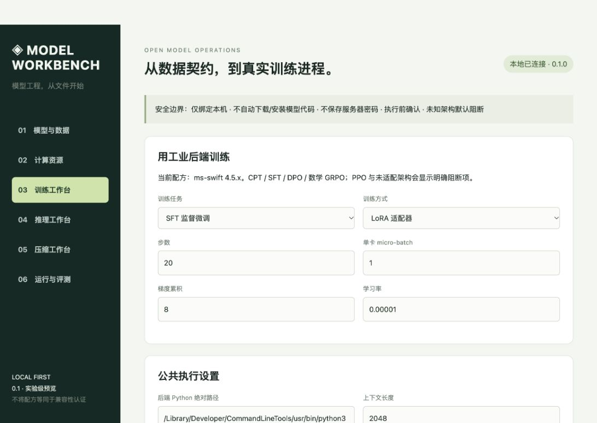

# 0.1 验证记录（2026-10-05）

## 模型下载与结构地图增量

- 完整离线回归扩展至 **49 项通过**；新增下载与恢复、Range、内容哈希、308重定向、路径/DNS边界、源不一致、结构证据分层测试。
- 实际访问 Hugging Face，界面同步 Qwen 组织12项实时模型目录。
- 实际读取 `HuggingFaceTB/SmolLM2-135M-Instruct` 的25文件清单，锁定 commit `12fd25f77366fa6b3b4b768ec3050bf629380bac`。
- 官方源与 HF Mirror 均完成该版本同一文件的2MiB测速。测试时官方约0.515MiB/s、镜像约0.338MiB/s，均含建连开销，仅为本次网络样本，不是服务商速度排行。镜像308重定向在Python3.9的兼容问题已修复。
- 从图形界面实际选择下载 `config.json`（861 bytes），任务状态 completed，Git blob哈希校验通过。保存于忽略目录 `.workbench/hub-smoke-config`；这是配置文件，不是完整可运行模型，未下载整个1.83GiB仓库。
- 结构页用本地safetensors测试夹具验证规格卡、流程示意、存储分布和张量表；夹具不是训练模型，没有据此宣称真实大模型兼容认证。
- 大文件长时间续传、跨公网断网、下载数百GiB模型仍待真实环境验收；私有/gated模型未实现。

## 2026-10-06 增量验收

- 目录浏览/批量模型扫描与技术说明增量后，66项自动化测试通过；覆盖路径授权、目录软链接越界、空目录、扫描上限、各技术说明完整性、执行计划不填虚假加速值。
- 浏览器用既有safetensors格式夹具验证“浏览父目录→发现模型→选择查看结构”；这不是实际模型运行认证。压缩页切换MLX4，7B教学值显示原16bit 13.04GiB、4.5bit估算3.67GiB，并明确实测速度尚无数据。

- 58项自动化测试通过，新增资源账本、非法输入、整节点加卡、未知结构阻断、QLoRA不盲目分片、魔搭版本锁定、日志脱敏与原生runner真实子进程/重复运行阻断测试。
- 魔搭Qwen公开目录实查成功；Qwen2.5-0.5B-Instruct的config.json实际读取659bytes，SHA-256与清单相同；权重只读取2MiB测速，不是模型下载/加载认证。
- 浏览器实测手填7B全参预算：在8GiB激活、4GiB工作区、2GiB聚合、20%余量下，H100条件起步3卡。这个结果是预算演示，不代表7B训练的公认最低卡数。
- 原生终端runner测试只运行Python输出文字，不运行模型。

## 已执行

- macOS / Apple Silicon / Python 3.9.6：`python3 -m unittest discover -s tests -v`，29 项全部通过。
- 覆盖模型元数据检查、路径逃逸拦截、分片缺失、自定义代码阻断、数据契约、命令参数、容量账本、真实子进程启动/结束/取消、HTTP 鉴权及跨源阻断。
- SSE 协议测试验证 usage 缺失、负数、流中断、失败请求不会生成虚假的吞吐结果；此处使用协议 fixture，不是模型跑分。
- 浏览器检查模型页、硬件页、训练配置页；读取真实 48 GiB 系统内存；刷新页面后认证仍有效。
- 检查修改输入后旧执行计划失效，避免界面参数与实际提交计划不一致。

## 未执行，不能作为已通过宣传

- 任何真实权重的加载、训练、生成、量化、质量回归。
- CUDA 多卡、跨节点、Nsight 捕获、云 SSH 巡检。
- 长时间稳定性、并发用户隔离、生产事故恢复。

当前发布级别为工程预览。GPU 兼容认证与尚未实现的工程能力是两件事：租到 GPU 不会自动补齐 PPO、音视频生成适配器、跨节点调度、剪枝与自动调优功能。

